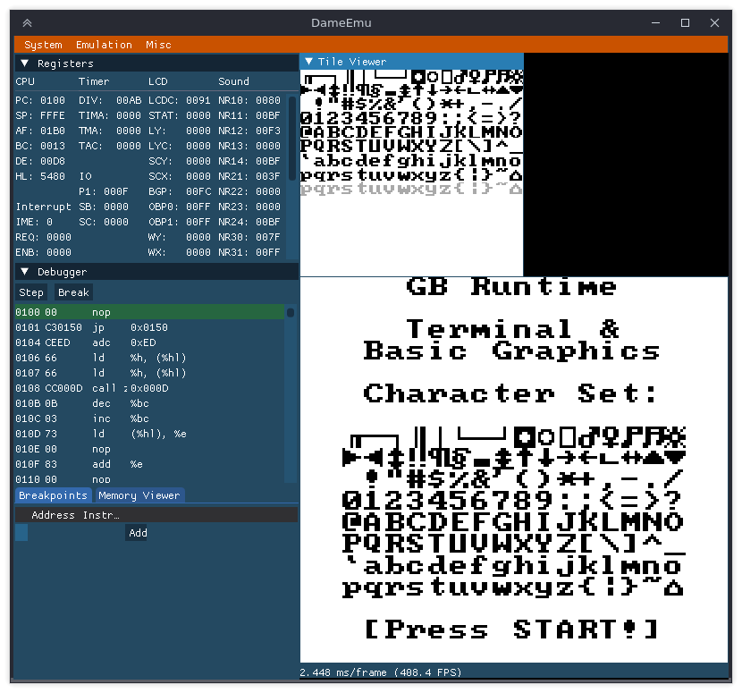

# DameEmu 

DameEmu is a GameBoy emulator + debugger

## Screenshots

## Building
### Linux
* Install SFML and OpenGL development libraries
  * **Fedora:** `# dnf install SFML-devel mesa-libGL-devel`
  * **Ubuntu:** `# apt-get install libsfml-dev libg1-mesa-dev`
* Clone imgui and imgui-sfml:
  * `git clone https://github.com/ocornut/imgui.git`
  * `git clone https://github.com/eliasdaler/imgui-sfml.git`
  * (Optional) Use specific revisions of imgui and imgui-sfml repos
    * `cd imgui && git reset --hard e18abe3619cfa0eced163c027d0349506814816c && cd ..`
    * `cd imgui-sfml && git reset --hard 35185b16dade7f6237ccda82427682be4876db84 && cd ..`
* Build and install imgui-sfml
  * `mkdir <imgui-sfml repo path>/build && cd <imgui-sfml repo path>/build`
  * `cmake -DBUILD_SHARED_LIBS=ON -DIMGUI_DIR:FILEPATH=<imgui repo path> ..`
  * `# cmake --build . --target install`
* Build DameEmu
  * `mkdir <DameEmu repo path>/build && cd <DameEmu repo path>/build`
  * `cmake -DCMAKE_BUILD_TYPE=Debug ..`
  * `cmake --build . --config Debug --target all -- -j`

## License
This project is licensed under the MIT License - see the [LICENSE](LICENSE) file for details
