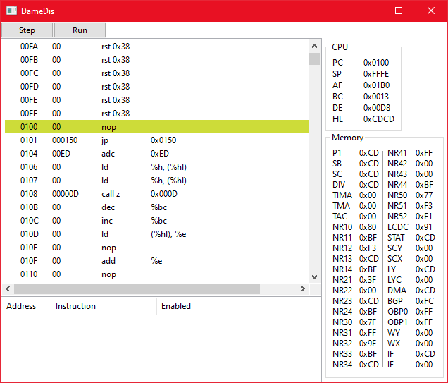

# DameEmu 

DameEmu is a GameBoy emulator + debugger

## Building
### Windows
* Install wxWidgets
* Ensure environment variables are set:
  * `wxWidgets_ROOT_DIR C:\wxWidgets`
  * `wxWidgets_ROOT_DIR C:\wxWidgets\lib\vc_lib`
* Create a directory for the build files
* Run CMake
  * `cmake -G "Visual Studio 16 2019" -AWIN32 ..`

## Screenshots

## License
This project is licensed under the MIT License - see the [LICENSE](LICENSE) file for details
